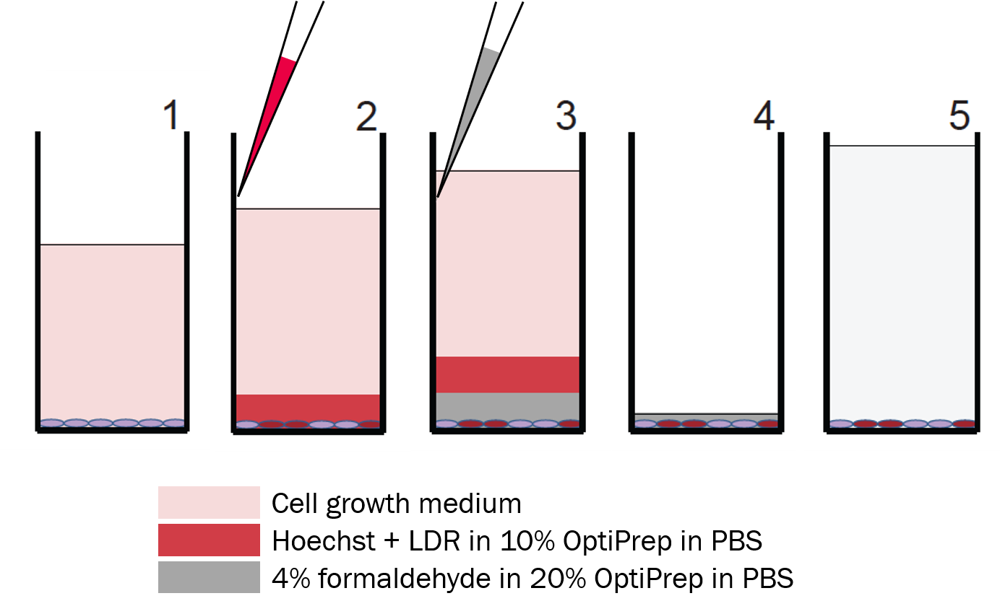
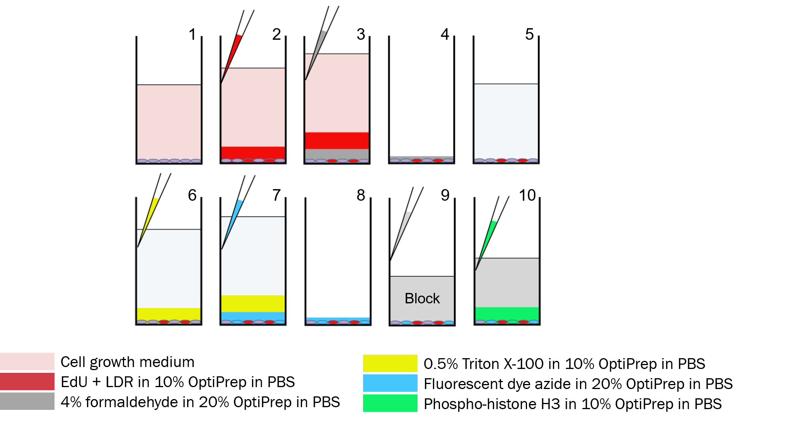

A common contributor of irreproducibility in high content live-cell or immunofluorescent assays performed in mulit-well plates is uneven loss of cells, particularly those that are dying or undergoing mitosis (both of which are less adherent than interphase cells). 

Dye drop methods use a sequence of solutions each made slightly denser than the last by addition of iodixanol (OptiPrepTM), an inert liquid used in radiology. Denser solution displaces the previous solution with high efficiency and minimal mixing. This effectively eliminates the need for mix and wash steps, where most of the uneven cell loss occurs.

*On this page, we show overviews of the dye drop and deep dye drop procedures. Details like solution volume and incubation time will vary based on the equipment and reagents used. For more detailed protocol used to generate our published results, please head to our [protocols.io page](https://www.protocols.io/view/deep-dye-drop-protocol-96zh9f6).*

* TOC
{:toc}

## Dye Drop

**Step 1: Start with cells in growth medium**

**Step 2: Stain**

Using a multi-channel pipette, gently add Hoechst+Live/Dead Red (LDR) in 10% OptiPrepTM in shosphate buffered saline (PBS) down the wall of the wells. 

Dead cells are stained by LDR.

**Step 3: Fix**

Add 4% formaldehyde in 20% OptiPrepTM in PBS down the wall of the wells. This solution will displace the stain solution at the bottom of the well.

**Step 4: Aspirate**

Remove the solutions in the wells, leaving some formaldehyde at the bottom to minimize cell loss.

**Step 5: Image or Store**

Image or store fixed cells in PBS at 4&deg;C

## Deep Dye Drop

**Step 1: Start with cells in growth medium**

**Step 2: LDR + EdU Stain**
    
Using a multi-channel pipette, gently add Live/Dead Red (LDR) and EdU(5-ethylnyl-2'-deoxyuridine) in 10% OptiPrepTM in PBS solution down the wall of the wells.

Dead cells are stained by LDR.

**Step 3-5: Same as Dye Drop**
    
Store in PBS at the end of Step 5

**Step 6: Permeablize**

Add 0.5% Triton X-100 in 10% OptiPrepTM to permeabilize cell membranes. 

**Step 7: Click Label EdU**

Fluorescently label EdU with a fluorescent dye azide via Click chemistry in 20% OptiPrepTM

S-phase cells are stained by fluorecently-labeled EdU.

**Step 8: Aspirate**

Remove solutions from the wells via gentle aspiration

**Step 9: Block**

Add blocking solution

**Step 10: pH3 Antibody**

Stain with a conjugated antibody against phospho-histone H3 (pH3) in 10% OptiPrepTM

M-phase cells are stained by pH3-targeting antibodies.
